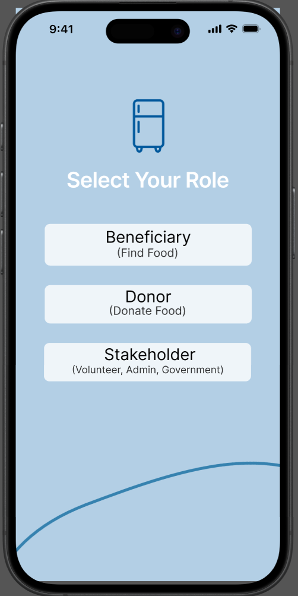
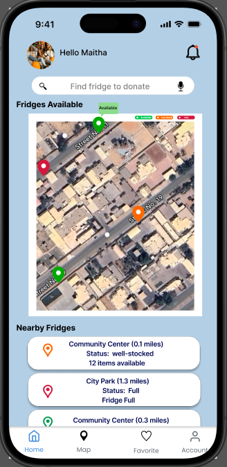
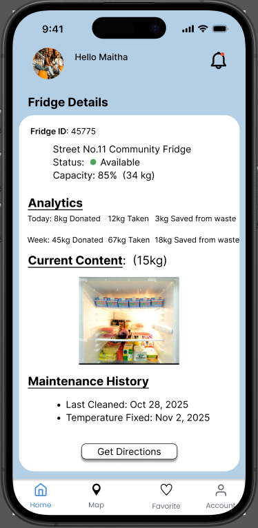

# Community Refrigerator Management System

## Overview
Mobile application that helps people in need locate community refrigerators with available food, improving accessibility and reducing food waste

## Features
- Locate nearby community refrigerators
- View available food items
- AI-based image classification to assess refrigerator stock levels (empty, partially stocked, or full)

## My Contribution
- Participated in requirements analysis, system design, implementation, and testing phases
- Contributed to SRS, design, and testing documentation
- Integrated Google Maps API and an AI chatbot via API, and implemented a CNN model for refrigerator status classification

## Prototype
An interactive prototype was developed to demonstrate the application flow and interface.

## 📸 Screenshots

| Login Page | Home Page | Fridge Content Page |
|------------|------------|---------------------|
|  |  |  |

## Documentation
Project documents are available in the `docs/` folder.

## Technologies
- Flutter
- Firebase
- VS Code
